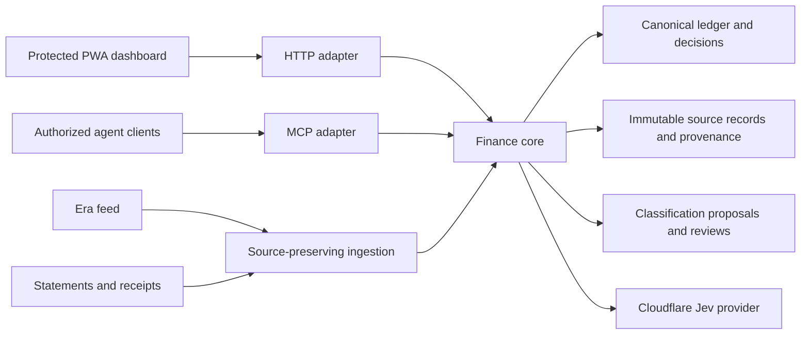

# Architecture and custody

Target boundaries: core defines operations, source linking, totals, revisions and review semantics. UI renders and curates those results; MCP exposes the same functions and contracts. Jev proposes and records actual model/version, contract hash and scores; acceptance stays in review. Categories and examples belong to this product, not the transport.

Implemented locally: core.mjs; immutable normalized imports with explicit canonical links; aggregate/query/coverage/export; history-only proposals and reviews; store.mjs serialization/atomic writes; stdio MCP and authenticated loopback HTTP adapters; optional Ma8ic provider; preferred dependency-free cloudflare-jev-provider.mjs accepting env.AI.

Current live system is separate: a Cloudflare Worker serves the HTML dashboard and a shared D1 snapshot/overrides behind Access. It does not yet call this core. Current source coverage counts are not a complete line-reconciliation engine. UI calculations still need migration to the core. Never claim the target diagram is fully deployed.

Private source custody: detailed ledger/source files are outside Git; raw exports do not belong in either app or cookbook. Cookbook holds charter, methods, sanitized findings and rail. App holds deployable code, contract and synthetic tests. Some existing cloud bootstrap HTML embeds account/source inventory and balance snapshots: sanitize/move that content to protected runtime storage before putting the UI in a public code repository.

Concurrency: local adapters take an exclusive file lock and write atomically; stale revisions fail. D1-backed production adapter needs transactional review/import semantics. Do not solve a conflict by replacing cloud data with an older local snapshot.

Auth: local stdio trusts its launcher; HTTP is loopback-only and requires a private bearer token. Production UI uses Access with an exact allowlist and independent JWT verification. Remote MCP authentication is not implemented; browser session cookies are not a substitute for client authorization. No tokens in config or docs.

Ingestion: preserve Era, statements and receipts separately, then link canonical transactions. Exact replays must be harmless; conflicts stay reviewable. Dates across statement cycles need adjacent evidence. Source counts cannot prove complete coverage; check every statement line and balance controls. Generic PDF extraction and Era refresh are pending.

Local dashboard now imports dashboard-domain.mjs (scope, splits, reimbursement filter, merchant aliases and planning items), also used by the core spending projection for scope selection. Cloud sources stage the same module as a protected generated asset. Production remains unchanged. Rich legacy metadata/state migration and remaining financial projections are owed before end-to-end parity.

Composition contract: contracts/composition.md separates evidence, facts, classification, typed flows, pure projections and service faces. Snapshot migration preserves legacy decisions as derivative evidence, then query/summarize compose flows rather than add page endpoints. The temporary dashboard query compatibility view must be retired. Private local core state now holds an exact round-trip of 857 records and context; this is a copy for validation, not a production migration or certification of original-source completeness.

Local integration now uses the same private core state for browser reads/saves, authenticated HTTP and stdio MCP. The Python localhost adapter serves only declared UI assets and proxies read/decision commands to the core; it holds its bearer credential outside Git and does not expose the state or credential file. Actual adapter tests prove an HTTP decision save is visible through MCP. This is local integration, not cloud release or full projection migration.

Cloud adapter staged: d1-store.mjs deterministically projects legacy snapshots on reads without writes, and persists a source-preserving core state only when an authorized revisioned command succeeds under compare-and-swap. worker.mjs validates Access signature/issuer/audience/expiry and an environment-supplied allowlist before HTTP/MCP dispatch. It has no frontend asset handler yet and must not replace the live Worker as-is. Access-credential provisioning for external MCP clients and frontend migration remain pending.

October 7 frontend migration: frontend/App.svelte declares the existing dashboard shell, with transitional controller.js and shared dashboard-domain.mjs. Vite emits HTML/CSS/JS and runs the public-asset ingredient check. The local preview on port 8770 reads the same protected local snapshot through the existing port-8766 proxy. This is not complete projection parity: the controller retains legacy chart, budget and summary calculations. Private monetary reference notes, account card snapshots and original account/source inventories were extracted to an untracked 0600 runtime-migration file outside this repo. Their protected state migration remains pending. Mixed-deposit hero totals now use the same recordedFlows transform rather than a hardcoded allocation; textual estimates stay unresolved. The preview explicitly marks its gaps; production remains unchanged. No asset binding or cloud release is enabled yet.

Core series migration, October 7: the development frontend requests `project` / summarize / flows with explicit scope, period, reimbursement visibility and classification-group filters. Core-produced typed measures now drive Overview heroes; core series drive the stacked chart, legend percentages, category rankings and recorded category table. Responses must match the loaded snapshot revision; stale/failed results are rejected rather than recomputed client-side. The cash hero uses the core funding comparison. Category detail, bills, budgets, source coverage and remaining planning numbers still have legacy renderer calculations and are not certified as migrated. The localhost proxy forwards the four capability envelopes to the existing authenticated core rather than implementing a second financial service.

Observed parity: 24 read-only combinations of Home/Work/Combined, Q3/each Q3 month and reimbursed-visibility options returned identical composed series payloads through direct core, authenticated HTTP and actual stdio MCP at ledger revision 1. A before/after hash check confirmed the private local state was unchanged. The rendered Home preview showed the same monthly spending-gap value as the core funding comparison. These are local transport and selected rendering checks; they do not certify every page or production behavior. Private receipt: series-transport-parity.json, retained outside Git.

Projection migration update: merchant/category/detail drilldowns and commitment planning now consume core projections. Account/month coverage counts consume the evidence collection, including nullable original feed counts and source references. Overview averages and expected contribution period totals are formatted from core measures. Remaining browser financial calculations include the cash movement table, budget-together comparison, coverage summary reconciliation labels and some transaction/funding summaries; complete UI parity remains unproven.

Current October7 boundary specification: contracts/component-boundaries.md names component ownership, durable application truth, replacement boundaries and four-tool reason. It supersedes older statements above that cash/budget/coverage/cards still use independent client calculations: current core projection mappings are in docs/capability-map.md. Private local runtime metadata has been imported additively at revision2, not into production. Expanded96-case core/HTTP/stdio MCP read parity covers flows, commitments, evidence, account snapshots and records pagination under Home/Work/Combined and selected filters; bytes are unchanged. Cloud deployment, current cloud-data migration, browser mutation journeys and fullUI action inventory remain unproven.
