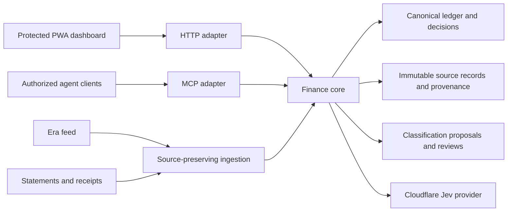

# Architecture and custody

Target boundaries: core defines operations, source linking, totals, revisions and review semantics. UI renders and curates those results; MCP exposes the same functions and contracts. Jev proposes and records actual model/version, contract hash and scores; acceptance stays in review. Categories and examples belong to this product, not the transport.

Implemented locally: core.mjs; immutable normalized imports with explicit canonical links; aggregate/query/coverage/export; history-only proposals and reviews; store.mjs serialization/atomic writes; stdio MCP and authenticated loopback HTTP adapters; optional Ma8ic provider; preferred dependency-free cloudflare-jev-provider.mjs accepting env.AI.

Current live system is separate: a Cloudflare Worker serves the HTML dashboard and a shared D1 snapshot/overrides behind Access. It does not yet call this core. Current source coverage counts are not a complete line-reconciliation engine. UI calculations still need migration to the core. Never claim the target diagram is fully deployed.

Private source custody: detailed ledger/source files are outside Git; raw exports do not belong in either app or cookbook. Cookbook holds charter, methods, sanitized findings and rail. App holds deployable code, contract and synthetic tests. Some existing cloud bootstrap HTML embeds account/source inventory and balance snapshots: sanitize/move that content to protected runtime storage before putting the UI in a public code repository.

Concurrency: local adapters take an exclusive file lock and write atomically; stale revisions fail. D1-backed production adapter needs transactional review/import semantics. Do not solve a conflict by replacing cloud data with an older local snapshot.

Auth: local stdio trusts its launcher; HTTP is loopback-only and requires a private bearer token. Production UI uses Access with an exact allowlist and independent JWT verification. Remote MCP authentication is not implemented; browser session cookies are not a substitute for client authorization. No tokens in config or docs.

Ingestion: preserve Era, statements and receipts separately, then link canonical transactions. Exact replays must be harmless; conflicts stay reviewable. Dates across statement cycles need adjacent evidence. Source counts cannot prove complete coverage; check every statement line and balance controls. Generic PDF extraction and Era refresh are pending.

Local dashboard now imports dashboard-domain.mjs (scope, splits, reimbursement filter, merchant aliases and planning items), also used by the core spending projection for scope selection. Cloud sources stage the same module as a protected generated asset. Production remains unchanged. Rich legacy metadata/state migration and remaining financial projections are owed before end-to-end parity.

Composition contract: contracts/composition.md separates evidence, facts, classification, typed flows, pure projections and service faces. Snapshot migration preserves legacy decisions as derivative evidence, then query/summarize compose flows rather than add page endpoints. The temporary dashboard query compatibility view must be retired. Private local core state now holds an exact round-trip of 857 records and context; this is a copy for validation, not a production migration or certification of original-source completeness.

Local integration now uses the same private core state for browser reads/saves, authenticated HTTP and stdio MCP. The Python localhost adapter serves only declared UI assets and proxies read/decision commands to the core; it holds its bearer credential outside Git and does not expose the state or credential file. Actual adapter tests prove an HTTP decision save is visible through MCP. This is local integration, not cloud release or full projection migration.
